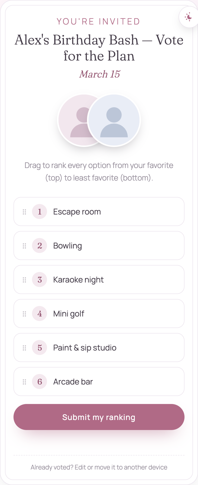
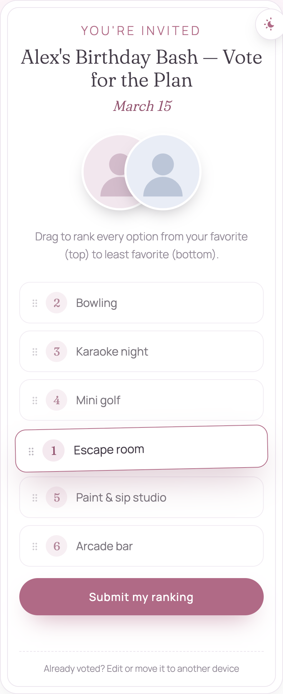
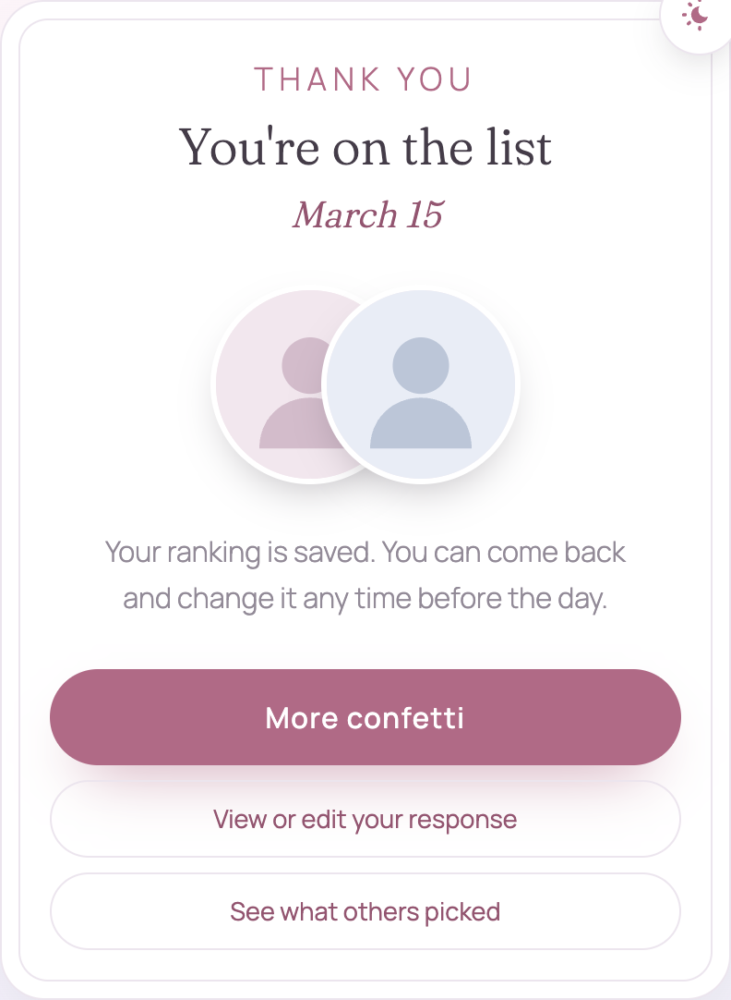
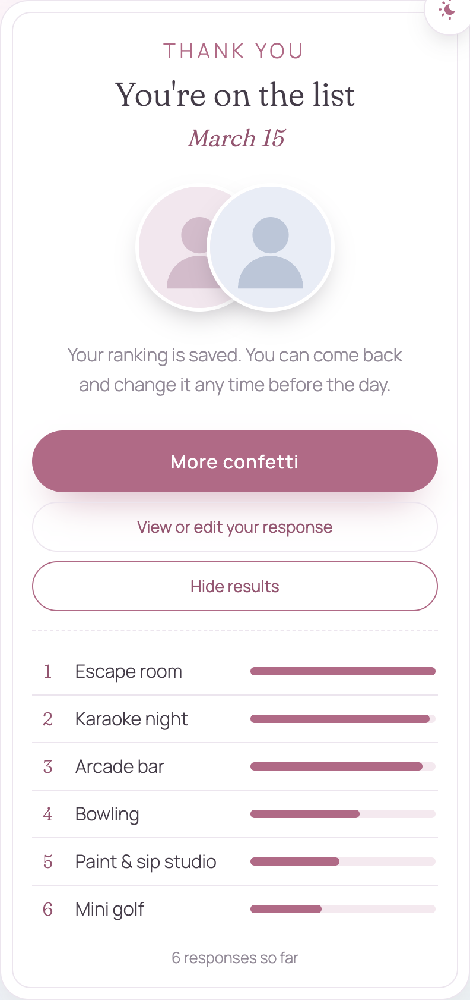
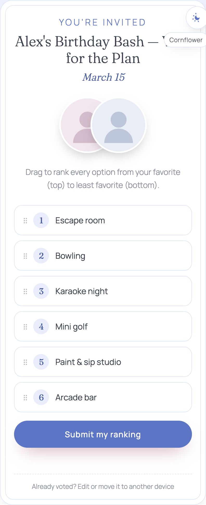
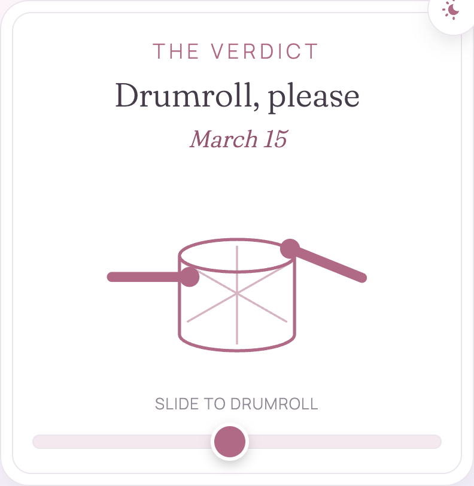

# custom-survey

A tiny self-hosted **ranked-choice survey** for picking a group activity. People
drag the options into their preferred order — the order *is* their ranking, so
it's impossible to rank two things the same or skip one. Anonymous, editable,
no accounts.

Built for "what should we actually do for the birthday / offsite / trip?", but
the options, title, date and venues are all just config.

> The screenshots and the committed `config.json` use a made-up event
> ("Alex's Birthday Bash", generic venues). Drop in your own details before you
> share it.

<p align="center">
  
  
  
</p>
<p align="center">
  
  
  
</p>
<p align="center">
  
</p>

## Features

- **Drag-to-rank** — reorderable list (pointer + touch), animated: the dragged
  card lifts and tilts, the others slide to open a gap, everything renumbers on
  drop. No "same rank" or "skipped option" states are possible.
- **Anonymous** — no name/email. Each browser gets a random private token in
  `localStorage`; that's the only thing tying a response to a person. Copy the
  token to edit the same response from another device.
- **Editable** — submit again to overwrite. A thank-you screen offers *edit your
  response* and *see what others picked* (a live Borda-count leaderboard).
- **Confetti** on submit, plus a *More confetti* button that fires from a fresh
  origin each press.
- **11 light colour themes** — one button, top-right, cycles them; choice is
  remembered. White surfaces stay white, backgrounds stay gradient, fonts don't
  change.
- **Drumroll reveal** — after the submission deadline, visitors get a drum with a
  slider: sliding speeds up the drumsticks, and reaching the end fires confetti
  and reveals the winning activity with its location, address, time and a Google
  Maps link.
- **One flat file** for storage (`data.json`) and a serialized write queue — fine
  for a poll with dozens of guests.

## Quick start

Requires Node.js 16+.

```bash
npm install
npm start
```

Open <http://localhost:3000>. On first run it prints an admin key (also saved to
`admin_key.txt`) — the results page is `/results.html?key=<key>`.

## Configure

Everything lives in [`config.json`](config.json):

| Field | What it does |
| --- | --- |
| `title` | Heading on the form |
| `description` | Instruction line under the photos |
| `dateLabel` | Short date shown under the title (e.g. `"March 15"`) |
| `activities` | The options to rank (2+; any number) |
| `submissionsCloseAt` | Local datetime, no timezone — after this, visitors get the drumroll/winner view instead of the form, and the server rejects new votes |
| `event.time` | Full date/time shown on the winner screen |
| `event.venues` | Per-activity `{ location, address, mapsUrl }`. Only the winner's is shown; if `mapsUrl` is blank a Google Maps search link is built from the address |

The two photos on the form are placeholders — replace the `src` of
`.photo--left` / `.photo--right` in [`public/index.html`](public/index.html) with
real images (or `data:` URIs).

Keeping real names/dates/venues out of git: put them in `config.real.json`
(git-ignored) and `cp config.real.json config.json` before you deploy.

## Deploy — Cloudflare Tunnel (free, no account, HTTPS)

Run it on any machine you can leave on until the event and expose it with a free
Cloudflare quick tunnel — no account, no domain, no port-forwarding.

One-time: `brew install cloudflared` (macOS), or see the
[downloads page](https://developers.cloudflare.com/cloudflare-one/connections/connect-networks/downloads/).

Then:

```bash
./run-public.sh
```

That script starts the server (votes saved to `./data/`), opens the tunnel,
restarts either half if it dies, and keeps a Mac awake while it runs. It prints:

```
https://<random-words>.trycloudflare.com
```

— the link to share. No login for respondents. `Ctrl+C` stops everything.

**The quick-tunnel URL is not stable** — it lives only as long as that
`cloudflared` process. If it restarts you get a new URL and have to re-share. For
a permanent URL, use a **named tunnel** (needs a free Cloudflare account + a
domain on Cloudflare):

```bash
cloudflared tunnel login
cloudflared tunnel create custom-survey
cloudflared tunnel route dns custom-survey survey.yourdomain.com
cloudflared tunnel run --url http://localhost:3000 custom-survey   # run `npm start` alongside
```

## Deploy — Docker / other hosts

The app reads/writes its vote file at `$DATA_DIR` (default: the project folder),
so it runs anywhere with a persistent directory.

```bash
docker build -t custom-survey .
docker run -p 3000:3000 -v survey-data:/data custom-survey
```

Fly.io / Railway / a VPS work too — attach a volume and point `DATA_DIR` at its
mount path. On PaaS free tiers **without** a persistent volume, `data.json` is
wiped on every restart/redeploy, so always give it a real disk.

## How it works

- `GET /api/config` — public config (title, activities, deadline, event).
- `GET /api/vote/:token` / `POST /api/vote` / `DELETE /api/vote/:token` — a
  respondent's own entry. `POST` validates that the body is a clean permutation
  of `activities` and is refused after `submissionsCloseAt`.
- `GET /api/summary` — public aggregate: Borda points per activity, total count,
  **no per-response data**.
- `GET /api/results?key=<admin key>` — full breakdown incl. per-rank counts.

Responses live in `data.json` (`$DATA_DIR`) as
`{ "responses": { "<token>": { "ranking": [...], "updatedAt": "..." } } }`.
Delete the file to reset. The admin key sits next to it in `admin_key.txt`
(or set `ADMIN_KEY=… npm start`).

## Regenerating the screenshots

```bash
npm install                 # dev dep: puppeteer-core (uses your system Chrome)
npm start                   # in another shell
node scripts/screenshots.mjs
```

Writes `docs/screenshots/*.png`, seeding and then clearing a handful of throwaway
votes so the results/winner views have data.

## License

MIT — see [LICENSE](LICENSE).
